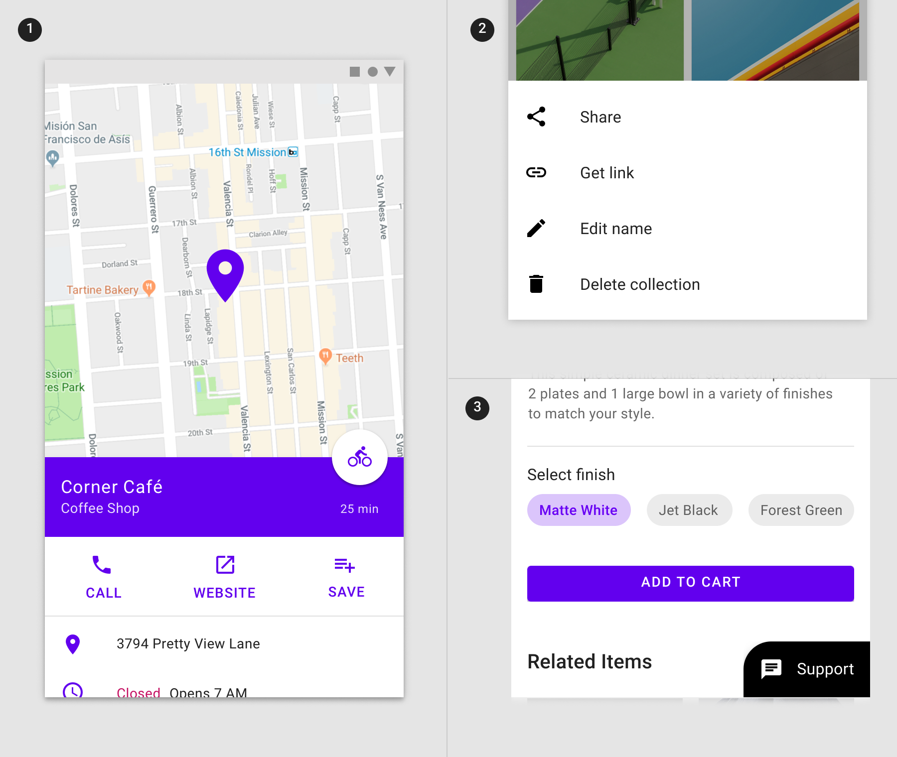
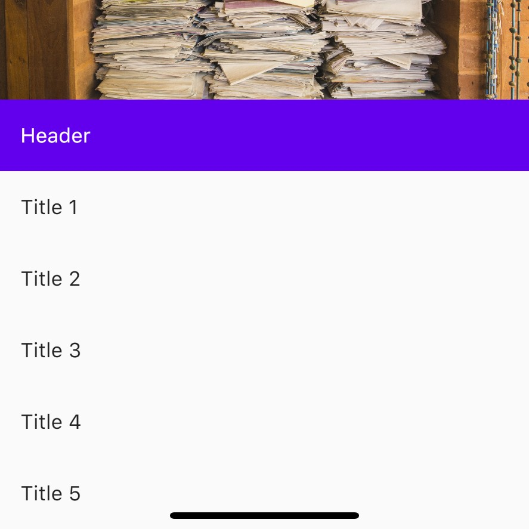
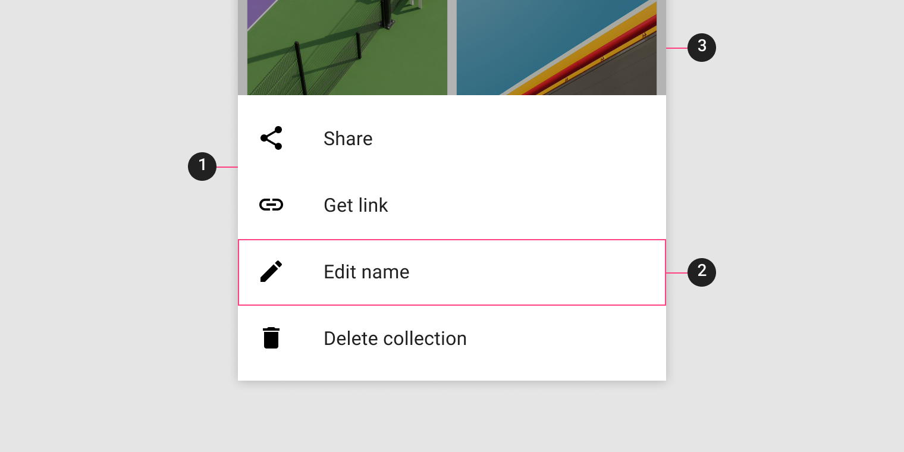
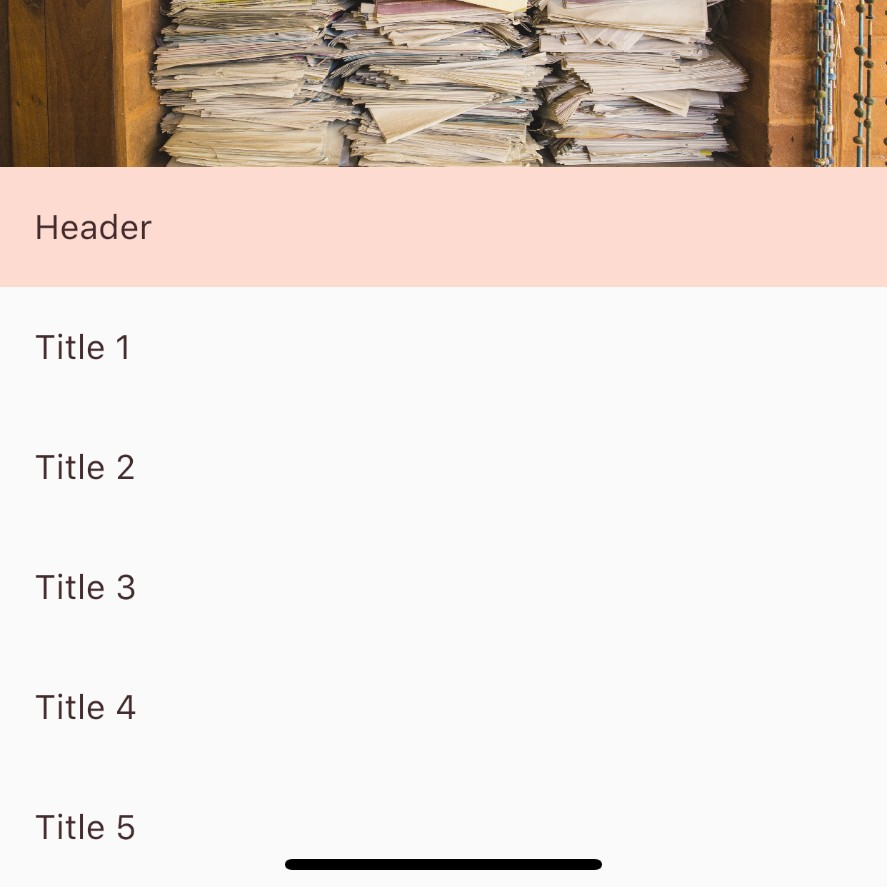

<!--docs:
title: "Material sheets: bottom"
layout: detail
section: components
excerpt: "Bottom sheets are surfaces containing supplementary content that are anchored to the bottom of the screen."
iconId:
path: /catalog/material-sheets-bottom/
-->

# Sheets: bottom

[Bottom sheets](https://material.io/components/sheets-bottom) are surfaces containing supplementary content that are anchored to the bottom of the screen.


**Contents**

- [Using bottom sheets](#using-bottom-sheets)
- [Making bottom sheets accessible](#making-bottom-sheets-accessible)
- [Standard bottom sheet](#standard-bottom-sheet)
- [Modal bottom sheet](#modal-bottom-sheet)
- [Expanding bottom sheet](#expanding-bottom-sheet)
- [Theming bottom sheets](#theming-bottom-sheets)

## Using bottom sheets

Bottom sheets are supplementary surfaces primarily used on mobile.

Before you can use bottom sheets, you need to import the Material Components package for Flutter:

```dart
package:flutter/material.dart
```

You need to be using a [`MaterialApp`](https://api.flutter.dev/flutter/material/MaterialApp-class.html).

For more information on getting started with the Material for Flutter, go to the Flutter [Material library](https://api.flutter.dev/flutter/material/material-library.html) page.

### Making bottom sheets accessible

Flutter's APIs support accessibility setting for large fonts, screen readers, and sufficient contrast. For more information, go to Flutter's [accessibility](https://flutter.dev/docs/development/accessibility-and-localization/accessibility) and [internationalization](https://flutter.dev/docs/development/accessibility-and-localization/internationalization) pages.

For more guidance on writing labels, go to [our page on how to write a good accessibility label](https://material.io/design/usability/accessibility.html#writing).

## Types

There are three types of bottom sheets: 1. [Standard bottom sheets](#standard-bottom-sheet) 2. [Modal bottom sheets](#modal-bottom-sheet) 3. [Expanding bottom sheets](#expanding-bottom-sheet)



## Standard bottom sheet

Standard bottom sheets co-exist with the screen’s main UI region and allow for simultaneously viewing and interacting with both regions. They are commonly used to keep a feature or secondary content visible on screen when content in main UI region is frequently scrolled or panned.

### Standard bottom sheet example

`BottomSheet`

- [Class definition](https://api.flutter.dev/flutter/material/ScaffoldState/showBottomSheet.html)
- [GitHub source](https://github.com/flutter/flutter/blob/master/packages/flutter/lib/src/material/bottom_sheet.dart)
- [Dartpad demo](https://dartpad.dev/embed-flutter.html?gh_owner=material-components&gh_repo=material-components-flutter&gh_path=docs/components/dartpad/bottom_sheets/standard&gh_ref=develop)


The following is an example expanded standard bottom sheet:


```dart
import 'package:flutter/material.dart';

void main() {
  runApp(MyApp());
}

class MyApp extends StatelessWidget {
  @override
  Widget build(BuildContext context) {
    return MaterialApp(
      title: 'Standard Bottom Sheet Demo',
      debugShowCheckedModeBanner: false,
      theme: ThemeData(
        colorScheme: Theme.of(context).colorScheme.copyWith(
          primary: Color(0xFF6200EE),
        ),
      ),
      home: Scaffold(
        // Use a Builder to get a context within the Scaffold.
        body: Builder(
          builder: (context) {
            return Center(
              child: TextButton(
                child: Text('SHOW BOTTOM SHEET'),
                onPressed: () {
                  showBottomSheet(
                    context: context,
                    builder: (context) {
                      final theme = Theme.of(context);
                      // Using Wrap makes the bottom sheet height the height of the content.
                      // Otherwise, the height will be half the height of the screen.
                      return Wrap(
                        children: [
                          ListTile(
                            title: Text(
                              'Header',
                              style: theme.textTheme.subtitle1
                                  .copyWith(color: theme.colorScheme.onPrimary),
                            ),
                            tileColor: theme.colorScheme.primary,
                          ),
                          ListTile(
                            title: Text('Title 1'),
                          ),
                          ListTile(
                            title: Text('Title 2'),
                          ),
                          ListTile(
                            title: Text('Title 3'),
                          ),
                          ListTile(
                            title: Text('Title 4'),
                          ),
                          ListTile(
                            title: Text('Title 5'),
                          ),
                        ],
                      );
                    },
                  );
                },
              ),
            );
          },
        ),
      ),
    );
  }
}
```

The persistent bottom sheet can be used for a standard bottom sheet.
Use a [DraggableScrollableSheet](https://api.flutter.dev/flutter/widgets/DraggableScrollableSheet-class.html) for more custom dragging and snap points.

### Anatomy and key properties

The following shows the anatomy of a standard bottom sheet:


1. Sheet
1. Contents

#### Sheets properties

&nbsp;         | Property
-------------- | ------------------------
| **Color** | `backgroundColor` |
| **Elevation** | `elevation` |
| **Shape** | `shape` |

#### Contents properties

There are no specific properties for content because the content can be any composition of widgets.

## Modal bottom sheet

Modal bottom sheets present a set of choices while blocking interaction with the rest of the screen. They are an alternative to inline menus and simple dialogs on mobile, providing additional room for content, iconography, and actions.

Modal bottom sheets are used in mobile apps only.

### Modal bottom sheet example

`BottomSheet`
- [Class definition](https://api.flutter.dev/flutter/material/showModalBottomSheet.html)
- [GitHub source](https://github.com/flutter/flutter/blob/master/packages/flutter/lib/src/material/bottom_sheet.dart)
- [Dartpad demo](https://dartpad.dev/embed-flutter.html?gh_owner=material-components&gh_repo=material-components-flutter&gh_path=docs/components/dartpad/bottom_sheets/modal&gh_ref=develop)

The following is an example modal bottom sheet:


```dart
import 'package:flutter/material.dart';

void main() {
  runApp(MyApp());
}

class MyApp extends StatelessWidget {
  @override
  Widget build(BuildContext context) {
    return MaterialApp(
      title: 'Standard Bottom Sheet Demo',
      home: Scaffold(
        // Use a Builder to get a context within the Scaffold.
        body: Builder(
          builder: (context) {
            return Center(
              child: TextButton(
                child: Text('SHOW BOTTOM SHEET'),
                onPressed: () {
                  showModalBottomSheet(
                    context: context,
                    builder: (context) {
                      // Using Wrap makes the bottom sheet height the height of the content.
                      // Otherwise, the height will be half the height of the screen.
                      return Wrap(
                        children: [
                          ListTile(
                            leading: Icon(Icons.share),
                            title: Text('Share'),
                          ),
                          ListTile(
                            leading: Icon(Icons.link),
                            title: Text('Get link'),
                          ),
                          ListTile(
                            leading: Icon(Icons.edit),
                            title: Text('Edit name'),
                          ),
                          ListTile(
                            leading: Icon(Icons.delete),
                            title: Text('Delete collection'),
                          ),
                        ],
                      );
                    },
                  );
                },
              ),
            );
          },
        ),
      ),
    );
  }
}
```

## Anatomy and key properties

The following shows the anatomy of a modal bottom sheet:



1. Sheet
1. Contents
1. Scrim


#### Sheets properties

&nbsp;         | Property
-------------- | ------------------------
| **Color** | `backgroundColor` |
| **Elevation** | `elevation` |
| **Shape** | `shape` |

#### Contents properties

There are no specific properties for content because the content can be any composition of widgets.

#### Scrim properties

&nbsp;         | Property
-------------- | ------------------------
| **Color** | `barrierColor` |


## Expanding bottom sheet

Expanding bottom sheets provide a small, collapsed surface that can be expanded by the user to access a key feature or task to offer the persistent access of a standard sheet with the space and focus of a modal sheet.

Expanding bottom sheets require creating a custom widget. See [Expanding bottom sheet](https://github.com/material-components/material-components-flutter/blob/develop/docs/components/expanding-bottom-sheet.md) for more info.

## Theming bottom sheets

Bottom Sheets support [Material Theming](https://material.io/components/sheets-bottom#theming) and can be customized in terms of color, elevation and shape.

Source code API:

- [Class definition](https://api.flutter.dev/flutter/material/BottomSheetThemeData-class.html)
- [Dartpad demo](https://dartpad.dev/embed-flutter.html?gh_owner=material-components&gh_repo=material-components-flutter&gh_path=docs/components/dartpad/bottom_sheets/theme&gh_ref=develop)

Theming for bottom sheet content can be done by theming the widgets that are inside the `widget` returned by the `builder` of `showBottomSheet` or `showModalBottomSheet`.

- The widget used for list items is commonly a `ListTile`, and can be themed with [`ListTileTheme`](https://api.flutter.dev/flutter/material/ListTileTheme-class.html).
- Other `Text`s and `Icon`s can be themed with [`TextTheme`](https://api.flutter.dev/flutter/material/TextTheme-class.html) and [`IconTheme`](https://api.flutter.dev/flutter/widgets/IconTheme-class.html).

The following shows a modal bottom sheet  with [Shrine theming](https://material.io/design/material-studies/shrine.html):


```dart
import 'package:flutter/material.dart';

void main() {
  runApp(MyApp());
}

class MyApp extends StatelessWidget {
  @override
  Widget build(BuildContext context) {
    return MaterialApp(
      title: 'Standard Bottom Sheet Demo',
      theme: _buildShrineTheme(),
      home: Scaffold(
        // Use a Builder to get a context within the Scaffold.
        body: Builder(
          builder: (context) {
            return Center(
              child: TextButton(
                child: Text('SHOW BOTTOM SHEET'),
                onPressed: () {
                  showBottomSheet(
                    context: context,
                    builder: (context) {
                      final theme = Theme.of(context);
                      // Using Wrap makes the bottom sheet height the height of the content.
                      // Otherwise, the height will be half the height of the screen.
                      return Wrap(
                        children: [
                          ListTile(
                            title: Text(
                              'Header',
                              style: theme.textTheme.subtitle1
                                  .copyWith(color: theme.colorScheme.onPrimary),
                            ),
                            tileColor: theme.colorScheme.primary,
                          ),
                          ListTile(
                            title: Text('Title 1'),
                          ),
                          ListTile(
                            title: Text('Title 2'),
                          ),
                          ListTile(
                            title: Text('Title 3'),
                          ),
                          ListTile(
                            title: Text('Title 4'),
                          ),
                          ListTile(
                            title: Text('Title 5'),
                          ),
                        ],
                      );
                    },
                  );
                },
              ),
            );
          },
        ),
      ),
    );
  }
}

IconThemeData _customIconTheme(IconThemeData original) {
  return original.copyWith(color: shrineBrown900);
}

ThemeData _buildShrineTheme() {
  final ThemeData base = ThemeData.light();
  return base.copyWith(
    colorScheme: _shrineColorScheme,
    accentColor: shrineBrown900,
    primaryColor: shrinePink100,
    buttonColor: shrinePink100,
    scaffoldBackgroundColor: shrineBackgroundWhite,
    cardColor: shrineBackgroundWhite,
    textSelectionColor: shrinePink100,
    errorColor: shrineErrorRed,
    buttonTheme: const ButtonThemeData(
      colorScheme: _shrineColorScheme,
      textTheme: ButtonTextTheme.normal,
    ),
    primaryIconTheme: _customIconTheme(base.iconTheme),
    textTheme: _buildShrineTextTheme(base.textTheme),
    primaryTextTheme: _buildShrineTextTheme(base.primaryTextTheme),
    accentTextTheme: _buildShrineTextTheme(base.accentTextTheme),
    iconTheme: _customIconTheme(base.iconTheme),
  );
}

TextTheme _buildShrineTextTheme(TextTheme base) {
  return base
      .copyWith(
    headline: base.headline.copyWith(
      fontWeight: FontWeight.w500,
      letterSpacing: defaultLetterSpacing,
    ),
    title: base.title.copyWith(
      fontSize: 18,
      letterSpacing: defaultLetterSpacing,
    ),
    caption: base.caption.copyWith(
      fontWeight: FontWeight.w400,
      fontSize: 14,
      letterSpacing: defaultLetterSpacing,
    ),
    body2: base.body2.copyWith(
      fontWeight: FontWeight.w500,
      fontSize: 16,
      letterSpacing: defaultLetterSpacing,
    ),
    body1: base.body1.copyWith(
      letterSpacing: defaultLetterSpacing,
    ),
    subhead: base.subhead.copyWith(
      letterSpacing: defaultLetterSpacing,
    ),
    display1: base.display1.copyWith(
      letterSpacing: defaultLetterSpacing,
    ),
    button: base.button.copyWith(
      fontWeight: FontWeight.w500,
      fontSize: 14,
      letterSpacing: defaultLetterSpacing,
    ),
  )
      .apply(
    fontFamily: 'Rubik',
    displayColor: shrineBrown900,
    bodyColor: shrineBrown900,
  );
}

const ColorScheme _shrineColorScheme = ColorScheme(
  primary: shrinePink100,
  primaryVariant: shrineBrown900,
  secondary: shrinePink50,
  secondaryVariant: shrineBrown900,
  surface: shrineSurfaceWhite,
  background: shrineBackgroundWhite,
  error: shrineErrorRed,
  onPrimary: shrineBrown900,
  onSecondary: shrineBrown900,
  onSurface: shrineBrown900,
  onBackground: shrineBrown900,
  onError: shrineSurfaceWhite,
  brightness: Brightness.light,
);

const Color shrinePink50 = Color(0xFFFEEAE6);
const Color shrinePink100 = Color(0xFFFEDBD0);
const Color shrinePink300 = Color(0xFFFBB8AC);
const Color shrinePink400 = Color(0xFFEAA4A4);

const Color shrineBrown900 = Color(0xFF442B2D);
const Color shrineBrown600 = Color(0xFF7D4F52);

const Color shrineErrorRed = Color(0xFFC5032B);

const Color shrineSurfaceWhite = Color(0xFFFFFBFA);
const Color shrineBackgroundWhite = Colors.white;

const defaultLetterSpacing = 0.03;
```